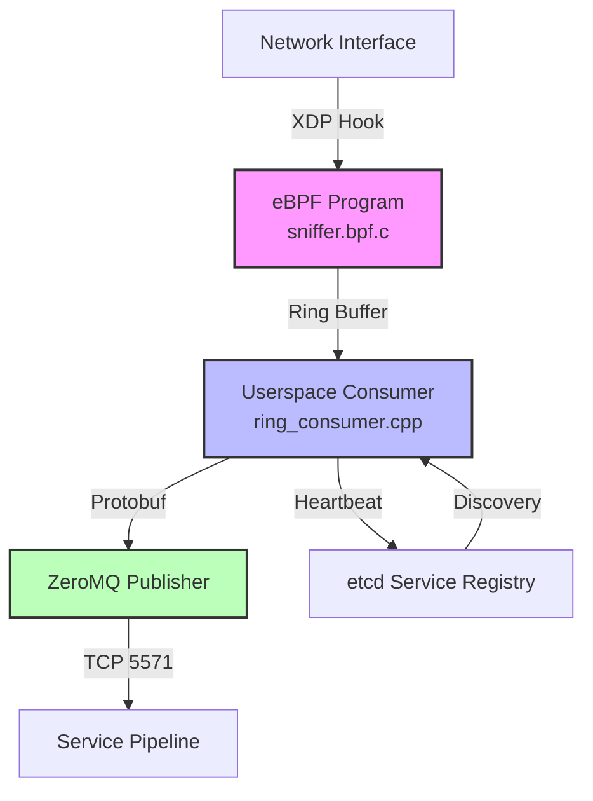

# C++20 Evolutionary Sniffer v3.1

High-performance network packet sniffer with eBPF/XDP kernel space capture and protobuf messaging.

[](https://github.com/your-repo/sniffer)
[](https://en.wikipedia.org/wiki/C%2B%2B20)
[](https://www.kernel.org/)
[](LICENSE)

## 🚀 Overview

The C++20 Evolutionary Sniffer is a high-performance network monitoring tool that captures packets at kernel level using eBPF/XDP technology and processes them in userspace with modern C++20 features. Designed for enterprise-grade packet analysis with Cloudflare-level performance aspirations.

### Key Features

- **🔥 Kernel-space capture**: eBPF/XDP programs for zero-copy packet processing
- **⚡ High performance**: Optimized for 10Gbps+ network interfaces
- **🧠 ML-ready**: Protobuf v3.1 with 83+ ML features for DDoS/ransomware detection
- **📡 Distributed**: ZeroMQ messaging with service discovery via etcd
- **🔧 Modern C++**: C++20 standard with advanced compiler optimizations
- **🐋 Cloud-native**: Docker containerization with orchestration support

## 📊 Architecture



### Data Flow

1. **Kernel Space**: eBPF program captures packets via XDP hook
2. **Ring Buffer**: Zero-copy transfer to userspace via BPF ring buffer
3. **Processing**: C++20 userspace application processes events
4. **Serialization**: Convert to protobuf `NetworkSecurityEvent` messages
5. **Transport**: ZeroMQ PUSH/PULL pattern for distribution
6. **Discovery**: etcd-based service registry for dynamic scaling

## 🏗️ Components

### Kernel Space (eBPF)
- **File**: `src/kernel/sniffer.bpf.c`
- **Function**: `xdp_sniffer_simple()`
- **Features**: Extracts basic packet info (IPs, ports, protocol, size)
- **Performance**: Optimized for minimal CPU cycles per packet

### Userspace (C++20)
- **Main**: `src/userspace/main.cpp` - Application lifecycle
- **Consumer**: `src/userspace/ring_consumer.cpp` - Ring buffer processing
- **Loader**: `src/userspace/ebpf_loader.cpp` - eBPF program management
- **Config**: `src/userspace/config_manager.cpp` - JSON configuration

### Protocol Schema
- **File**: `../protobuf/network_security.proto`
- **Package**: `protobuf`
- **Message**: `NetworkSecurityEvent`
- **Features**: 83+ ML features, geo-enrichment, distributed node info

## 🛠️ Build Requirements

### System Requirements
```bash
# Operating System
Ubuntu 22.04+ / Debian 12+ / RHEL 9+

# Kernel Version
Linux 5.4+ (recommended: 6.1+)

# Hardware
RAM: 4GB+ (recommended: 16GB+)
CPU: x86_64 with eBPF JIT support
Network: XDP-capable interface (recommended: 10Gbps+)
```

### Dependencies
```bash
# Build tools
cmake >= 3.20
clang >= 10
bpftool
pkg-config

# Libraries
libbpf-dev >= 0.8
libzmq3-dev >= 4.3
libprotobuf-dev >= 3.12
libjsoncpp-dev >= 1.9
```

## 🚀 Quick Start

### Using the Laboratory Environment (Recommended)
```bash
# Start the complete DDOS pipeline + sniffer
make lab-full-stack

# Or step by step:
make lab-start          # Start etcd + services
make sniffer-build      # Compile eBPF sniffer
make sniffer-start      # Start packet capture
make status             # Verify everything is running
```

### Manual Build & Run
```bash
# 1. Install dependencies (Ubuntu)
sudo apt update && sudo apt install -y \
    libbpf-dev libzmq3-dev libprotobuf-dev libjsoncpp-dev \
    clang bpftool cmake build-essential

# 2. Build
mkdir build && cd build
cmake .. -DCMAKE_BUILD_TYPE=Release
make -j$(nproc)

# 3. Run (requires root for eBPF)
sudo ./sniffer --config=../config/sniffer.json
```

## 📁 Project Structure

```
sniffer/
├── src/
│   ├── kernel/
│   │   └── sniffer.bpf.c           # eBPF XDP program
│   └── userspace/
│       ├── main.cpp                # Application entry point
│       ├── ebpf_loader.{cpp,hpp}   # eBPF program loader
│       ├── ring_consumer.{cpp,hpp} # Ring buffer consumer
│       └── config_manager.{cpp,hpp}# Configuration management
├── config/
│   └── sniffer.json               # Default configuration
├── docs/
│   ├── BUILD.md                   # Detailed build guide
│   └── BARE_METAL.md             # Physical deployment guide
├── scripts/
│   └── run_sniffer_with_iface.sh # Interface detection script
└── CMakeLists.txt                # Build system
```

## ⚙️ Configuration

### Basic Configuration (`config/sniffer.json`)
```json
{
  "component": {
    "name": "evolutionary_sniffer",
    "version": "3.1.0"
  },
  "node_id": "sniffer_001",
  "cluster_name": "production",
  "capture": {
    "interface": "eth0"
  },
  "network": {
    "output_socket": {
      "address": "127.0.0.1",
      "port": 5571,
      "socket_type": "PUSH"
    }
  }
}
```

### Advanced Options
- **Interface**: `"any"` for all interfaces, or specific like `"eth0"`
- **Output socket**: ZeroMQ endpoint for protobuf messages
- **Node ID**: Unique identifier for distributed deployments
- **Debug mode**: `--verbose` flag for detailed packet logging

## 🔬 Usage Examples

### Basic Packet Capture
```bash
# Capture on default interface with verbose output
sudo ./sniffer --config=config.json --verbose

# Test configuration without running
sudo ./sniffer --test-config --config=config.json

# Capture for specific duration
sudo ./sniffer --config=config.json --duration=300
```

### Integration with Pipeline
```bash
# Terminal 1: Start sniffer
make sniffer-start

# Terminal 2: Monitor protobuf messages
make service3-logs

# Terminal 3: View eBPF statistics
make sniffer-status
```

### Performance Monitoring
```bash
# View captured packet statistics
sudo bpftool map dump name stats

# Monitor system resource usage
htop -p $(pgrep sniffer)

# Network interface statistics
watch -n 1 'cat /proc/net/dev'
```

## 📊 Performance Characteristics

### Benchmarks (10Gbps interface)
- **Packet Rate**: Up to 14.88 Mpps (64-byte packets)
- **CPU Usage**: <5% per core at 1Gbps
- **Memory**: ~50MB baseline, +1MB per 100k packets/sec
- **Latency**: <1μs kernel processing, <10μs userspace

### Optimization Features
- **Zero-copy**: Direct memory mapping from kernel
- **JIT compilation**: eBPF programs compiled to native code
- **CPU affinity**: Configurable core binding
- **NUMA awareness**: Memory allocation optimization
- **Ring buffer tuning**: Configurable sizes for different workloads

## 🔍 Troubleshooting

### Common Issues

#### eBPF Program Loading Failed
```bash
# Check kernel support
grep CONFIG_BPF /boot/config-$(uname -r)

# Verify privileges
sudo dmesg | grep -i bpf

# Check program validity  
bpftool btf dump file sniffer.bpf.o
```

#### Permission Denied
```bash
# Ensure root privileges
sudo whoami

# Check capability requirements
sudo setcap 'cap_sys_admin,cap_net_admin+eip' sniffer

# Verify BPF filesystem
ls -la /sys/fs/bpf/
```

#### No Packets Captured
```bash
# Verify interface is up
ip link show eth0

# Check for existing XDP programs
sudo bpftool net show

# Generate test traffic
ping -c 10 8.8.8.8
```

#### High CPU Usage
```bash
# Enable JIT compilation
sudo sysctl net.core.bpf_jit_enable=1

# Reduce ring buffer polling frequency
# Edit config: increase timeout values

# Check for infinite loops in eBPF code
sudo bpftool prog tracelog
```

### Debug Mode
```bash
# Compile with debug symbols
cmake .. -DCMAKE_BUILD_TYPE=Debug

# Run with debugger
sudo gdb --args ./sniffer --config=config.json

# Enable verbose eBPF logging
echo 1 | sudo tee /sys/kernel/debug/tracing/events/bpf/enable
```

## 🚀 Performance Tuning

### System Optimization
```bash
# Enable eBPF JIT
sudo sysctl net.core.bpf_jit_enable=1

# Increase memory limits
ulimit -l unlimited

# Configure CPU governor
sudo cpupower frequency-set --governor performance
```

### Network Interface Tuning
```bash
# Increase ring buffer sizes
sudo ethtool -G eth0 rx 4096 tx 4096

# Disable hardware offloading for better capture
sudo ethtool -K eth0 gro off lro off tso off gso off

# Enable multi-queue
sudo ethtool -L eth0 combined 4
```

### Application Tuning
```bash
# CPU affinity (bind to specific cores)
taskset -c 0,1 ./sniffer --config=config.json

# High priority scheduling
sudo nice -n -20 ./sniffer --config=config.json

# Memory allocation optimization
export MALLOC_ARENA_MAX=1
```

## 📚 Documentation

- **[BUILD.md](docs/BUILD.md)** - Detailed compilation guide
- **[BARE_METAL.md](docs/BARE_METAL.md)** - Physical hardware deployment
- **[API Reference]** - Generated from code comments
- **[Examples]** - Sample configurations and use cases

## 🤝 Contributing

### Development Setup
```bash
# Clone with submodules
git clone --recursive <repo-url>

# Install pre-commit hooks
pre-commit install

# Run tests
make test
```

### Code Style
- **Standard**: C++20 with modern practices
- **Formatting**: clang-format with Google style
- **Linting**: clang-tidy with strict checks
- **Testing**: Catch2 framework for unit tests

## 📈 Roadmap

### Version 3.2 (Planned)
- [ ] Support for IPv6 packet capture
- [ ] Multi-interface load balancing
- [ ] Enhanced ML feature extraction
- [ ] Real-time statistics dashboard

### Version 4.0 (Future)
- [ ] GPU acceleration for packet processing
- [ ] Distributed capture across multiple nodes
- [ ] Advanced threat detection algorithms
- [ ] Integration with SIEM systems

## 🏆 Acknowledgments

- **eBPF Community** - For the amazing kernel technology
- **libbpf Project** - User-space eBPF library
- **ZeroMQ** - High-performance messaging
- **Protocol Buffers** - Efficient serialization

## 📄 License

This project is licensed under the GPL License - see the [LICENSE](LICENSE) file for details.

## 📞 Support

- **Issues**: [GitHub Issues](https://github.com/your-repo/sniffer/issues)
- **Discussions**: [GitHub Discussions](https://github.com/your-repo/sniffer/discussions)
- **Documentation**: [Wiki](https://github.com/your-repo/sniffer/wiki)

---

**Built with ❤️ for high-performance network monitoring**