# ARCHITECTURE.md — ML Defender (aRGus EDR)

**Version:** 5.1.0
**Last Updated:** March 12, 2026 — DAY 83
**Branch:** main (merged DAY 83)
**Status:** Production baseline validated — F1=1.0000, FPR=0.0049%

---

## Table of Contents

* [Overview](#overview)
* [System Components](#system-components)
* [Data Flow](#data-flow)
* [Dual-Score Decision Architecture](#dual-score-decision-architecture)
* [Fast Detector Path Architecture](#fast-detector-path-architecture)
* [Feature Extraction Taxonomy](#feature-extraction-taxonomy)
* [Deployment Models](#deployment-models)
* [Component Architecture](#component-architecture)
* [Cryptographic Transport](#cryptographic-transport)
* [Configuration System](#configuration-system)
* [Validated Results](#validated-results)
* [Performance Characteristics](#performance-characteristics)
* [Security Considerations](#security-considerations)
* [Development Environment](#development-environment)
* [Production Deployment](#production-deployment)
* [Roadmap](#roadmap)
* [Engineering Decision Records](#engineering-decision-records)
* [Addendum — Security & RAG Enhancements](#addendum--security--rag-enhancements)
* [Executive Summary — 2 Minutes for CTO](#executive-summary--2-minutes-for-cto)

---

## Overview

ML Defender (aRGus EDR) is an open-source, enterprise-grade network security system
designed to protect hospitals, schools, and small organizations from ransomware and
DDoS attacks. It combines a high-speed heuristic Fast Detector with an embedded
C++20 RandomForest ML pipeline to achieve both high recall and ultra-low false
positive rates.

### Design Philosophy

**Via Appia Quality** — Systems built like Roman roads, designed to endure decades.
**JSON is the LAW** — All configuration values, including ML thresholds, come from JSON files.
**Scientific Honesty** — All failures, limitations, and architectural debts are documented explicitly.

### Key Validated Results (DAY 83)

| Metric                          | Value        | Dataset                        |
| ------------------------------- | ------------ | ------------------------------ |
| F1-Score                        | **1.0000**   | CTU-13 Neris (19,135 flows)    |
| Precision                       | **1.0000**   | CTU-13 Neris                   |
| Recall                          | **1.0000**   | CTU-13 Neris                   |
| FPR (ML)                        | **0.0049%**  | bigFlows benign (40,467 flows) |
| FPR (Fast Detector)             | 76.8%        | bigFlows benign                |
| FP Reduction Factor             | **~15,500x** | ML vs Fast Detector alone      |
| Detection latency (embedded RF) | 0.24–1.06 µs | Per model                      |

---

## System Components

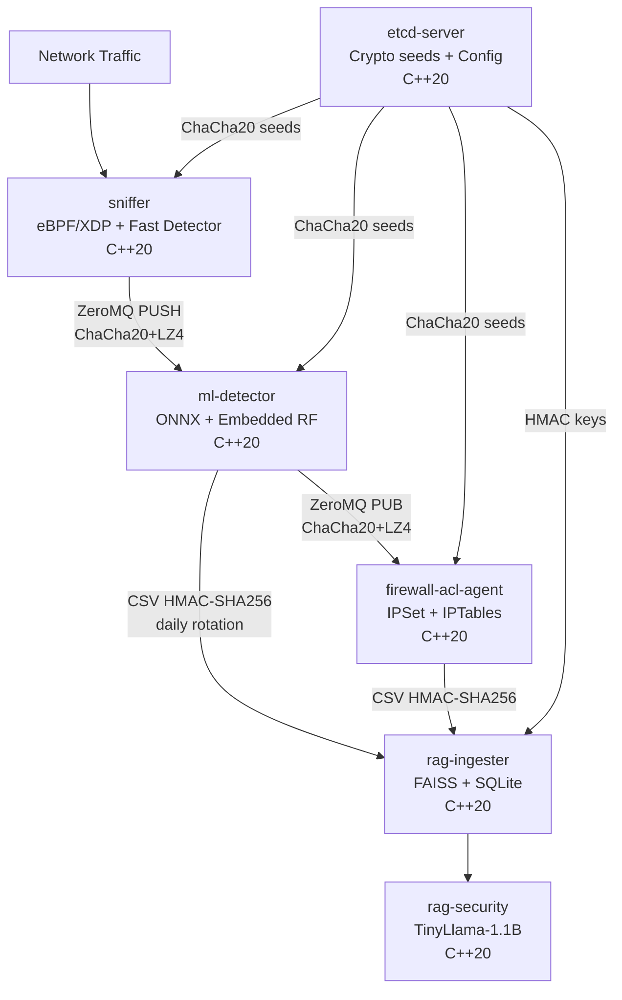

### Component Status (DAY 83)

| Component          | Language          | Status     | Binary                                              |
| ------------------ | ----------------- | ---------- | --------------------------------------------------- |
| sniffer            | C++20 + eBPF      | Production | `sniffer/build-debug/sniffer`                       |
| ml-detector        | C++20 + ONNX      | Production | `ml-detector/build-debug/ml-detector`               |
| firewall-acl-agent | C++20             | Production | `firewall-acl-agent/build-debug/firewall-acl-agent` |
| rag-ingester       | C++20             | Production | `rag-ingester/build-debug/rag-ingester`             |
| rag-security       | C++20 + llama.cpp | Production | `rag/build/rag-security`                            |
| etcd-server        | C++20             | Production | `etcd-server/build-debug/etcd-server`               |

---

## Data Flow

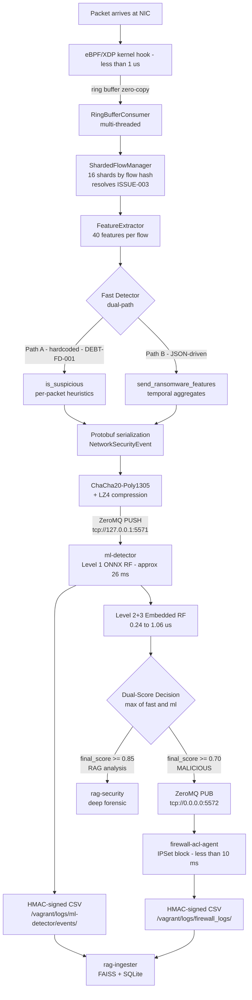

---

## Dual-Score Decision Architecture

The core architectural insight of ML Defender: the Fast Detector has high recall
but high FPR. The ML layer acts as a validator, not a replacement.

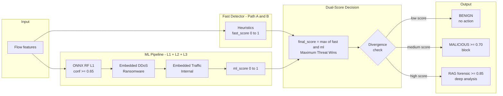

### Validated Impact of Dual-Score

| Signal | bigFlows benign (40,467 flows) | Meaning |
|--------|-------------------------------|---------|
| Fast Detector alerts | 31,065 | FPR = 76.8% |
| ML confirmed (conf >= 0.65) | **2** | FPR = **0.0049%** |
| FP reduction factor | **~15,500x** | ML validates, Fast Detector catches |

### Three Attack Counter Semantics (Architecture, Not a Bug)

| Signal | Condition | Semantic |
|--------|-----------|----------|
| log `ATTACK` | `label_l1 == 1` | RF binary vote |
| `stats_.attacks_detected` | `label_l1==1 AND conf >= 0.65` | Sufficient confidence |
| `final_classification=MALICIOUS` | `final_score >= 0.70` | Final system decision |

`level1_attack=0.65` is in `ml_detector_config.json` — separate from `sniffer.json`.

---

## Fast Detector Path Architecture

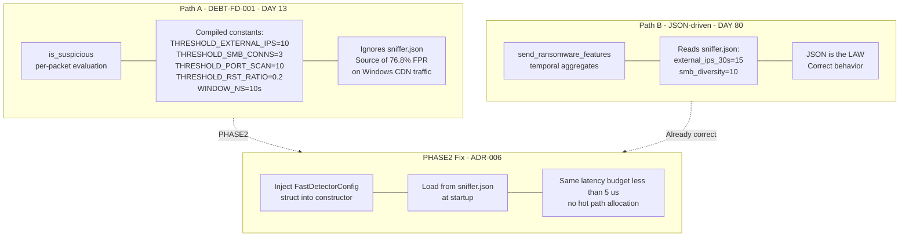

---

## Feature Extraction Taxonomy

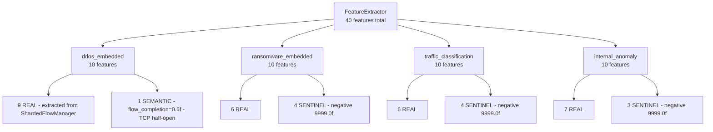

| Category | Count | Value      | Meaning                                                     |
| -------- | ----- | ---------- | ----------------------------------------------------------- |
| Real     | 28    | Extracted  | Computed from actual flow data                              |
| Sentinel | 11    | `-9999.0f` | Outside all RF split domains — routes deterministically     |
| Semantic | 1     | `0.5f`     | TCP half-open — valid domain value, not missing             |
| Total    | 40    | —          | —                                                           |

### Sentinel Taxonomy (DAY 79 — Critical Design Decision)

`MISSING_FEATURE_SENTINEL = -9999.0f` is confirmed outside all RandomForest split
domains. Any flow reaching a split on a sentinel-valued feature routes deterministically
to the same leaf — no spurious variance.

> **Never use `0.5f` or `NaN` as sentinels.** `NaN` propagates silently and corrupts
> RF arithmetic. `0.5f` is a valid semantic value (TCP half-open). Only `-9999.0f`
> is guaranteed safe. — ADR-DAY79

### Features Blocked at Phase 1 (DEBT-PHASE2)

| Feature                  | Blocker                                        | Fix    |
| ------------------------ | ---------------------------------------------- | ------ |
| `tcp_udp_ratio`          | `FlowStatistics` lacks `uint8_t protocol`      | PHASE2 |
| `flow_duration_std`      | Requires multi-flow `TimeWindowAggregator`     | PHASE2 |
| `protocol_variety`       | Requires multi-flow `TimeWindowAggregator`     | PHASE2 |
| `connection_duration_std`| Requires multi-flow `TimeWindowAggregator`     | PHASE2 |

---

## Deployment Models

### Development / Experiment Reproduction (Current)

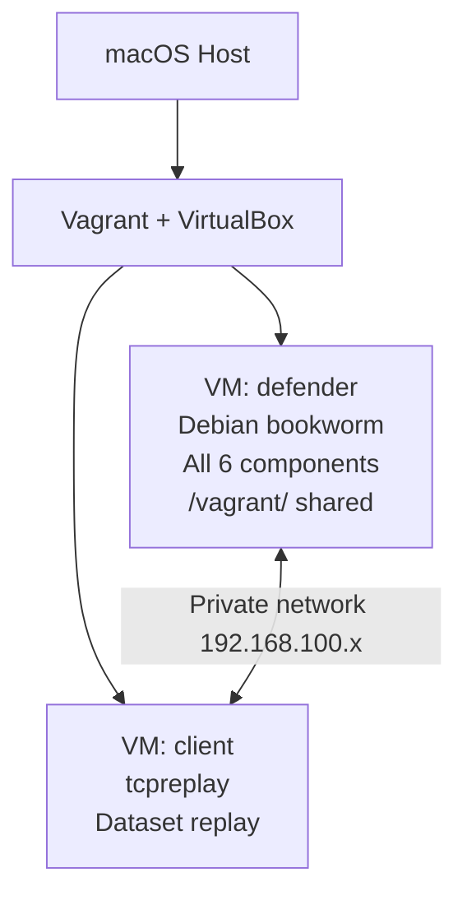

**Quick start for experiment reproduction:**
```bash
git clone https://github.com/yourusername/ml-defender.git
cd ml-defender
vagrant up defender client
make pipeline-start
sleep 15
make test-replay-neris
python3 scripts/calculate_f1_neris.py \
  /vagrant/logs/lab/sniffer.log --total-events 19135
# Expected: F1-Score: 1.0000
```

> Vagrant is the experiment reproduction environment only.
> Production deployments run bare-metal without VM overhead.

### Production — Naive Single-Node (Post-Paper)

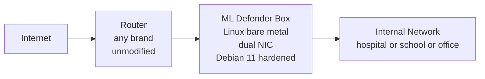

The router is never modified. ML Defender is a transparent bridge — any brand,
any firmware, zero dependency on network hardware.

**Hardware requirements:**
- Linux kernel >= 5.8 (eBPF/XDP support, standard since 2020)
- Dual NIC — any ~20 EUR PCIe card for SOHO; Intel i210/i350 for >1 Gbps
- RAM: ~900 MB (with TinyLlama loaded)
- Any mini-PC, NUC, Raspberry Pi 5, or repurposed server

### Production — Multi-Component Parallel (Enterprise Preview)

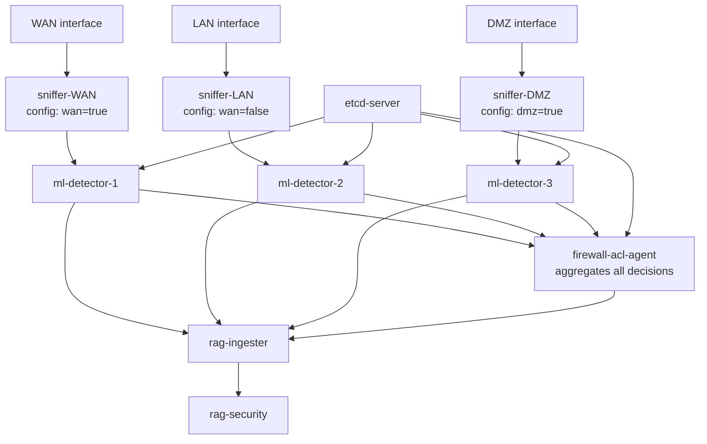

---

## Component Architecture

### sniffer (eBPF/XDP)

**Source:** `sniffer/`
**Config:** `sniffer/config/sniffer.json` — source of truth (NOT `build-debug/`)

**eBPF data structure:**
```c
struct simple_event {
    uint32_t src_ip;        uint32_t dst_ip;
    uint16_t src_port;      uint16_t dst_port;
    uint8_t  protocol;      uint8_t  tcp_flags;
    uint32_t packet_len;    uint16_t ip_header_len;
    uint16_t l4_header_len; uint64_t timestamp;
    uint16_t payload_len;   uint8_t  payload[512];
} __attribute__((packed)); // 544 bytes total
```

**Startup confirmation:**
```
[ML Defender] Thresholds (JSON): DDoS=0.85 Ransomware=0.9 Traffic=0.8 Internal=0.85
```

---

### ml-detector

**Source:** `ml-detector/`
**Config:** `ml-detector/config/ml_detector_config.json`

> Note: `ml-detector/src/ml_detector.cpp` is empty (0 bytes).
> All logic is in `ml-detector/src/zmq_handler.cpp` (927 lines). — DAY 82

#### Model Stack

| Level | Model                          | Features | Threshold | Latency     | Note                          |
| ----- | ------------------------------ | -------- | --------- | ----------- | ----------------------------- |
| L1    | ONNX RandomForest              | 23       | 0.65      | ~26 ms      | ONNX runtime overhead         |
| L2    | Embedded C++20 DDoS RF         | 10       | 0.70      | **0.24 µs** | 4.1M inferences/sec           |
| L2    | Embedded C++20 Ransomware RF   | 10       | 0.75      | **1.06 µs** | 944K inferences/sec           |
| L3    | Embedded C++20 Traffic RF      | 10       | 0.60      | **0.37 µs** | 2.7M inferences/sec           |
| L3    | Embedded C++20 Internal RF     | 10       | 0.65      | **0.33 µs** | 3.0M inferences/sec           |

> **ONNX L1 latency (~26 ms):** Dominated by ONNX runtime initialization, not
> inference. Can be reduced with `ORT_ENABLE_ALL` session options, or by converting
> L1 to embedded C++20 RF (same approach as L2+L3). Planned for PHASE2.

#### CSV Output

- Path: `/vagrant/logs/ml-detector/events/YYYY-MM-DD.csv`
- Condition: `final_score >= 0.50`
- Schema: 127 columns (validated DAY 64)
- HMAC-SHA256 per row — feeds directly into `rag-ingester` for forensic queries
- Daily rotation

---

### firewall-acl-agent

**Source:** `firewall-acl-agent/`

- Decrypts ChaCha20-Poly1305 events from ml-detector (ZeroMQ SUB)
- Decompresses LZ4
- Updates IPSet blacklist and applies IPTables DROP rule
- Writes HMAC-signed CSV: `/vagrant/logs/firewall_logs/firewall_blocks.csv`
- Stress tested: 364 ev/s, 54% CPU, 127 MB RAM, **0 crypto errors** @ 36K events
- **Current mode:** `simulate_block: true` (dry-run for development safety)

> **ADR-007 pending:** Current blocking uses `MAX(fast, ml)`. PHASE2 introduces
> AND consensus — both Fast Detector AND ML must agree above threshold before a
> block is applied. Reduces spurious blocks on ambiguous traffic.

---

### rag-ingester

**Source:** `rag-ingester/`

- Reads ml-detector CSV + firewall CSV
- Validates HMAC-SHA256 per row before ingestion (chain of custody)
- Embeds events into FAISS Attack index (256-d vectors)
- Stores metadata in SQLite
- Validated DAY 83: `lines=71,217 parsed_ok=71,217 hmac_fail=0 parse_err=0`

**HMAC key rotation policy (ADR-004):**
- Keys rotated via etcd with cooldown period
- Heartbeat: 30s interval, TTL: 60s
- All rows written with the key active at write time; validated with key active at read time

---

### rag-security

**Source:** `rag/`

- TinyLlama-1.1B (GGUF, llama.cpp backend)
- FAISS similarity search over Attack index
- Activated when `final_score >= 0.85`
- CLI forensic interface:
  ```bash
  rag ask_llm "What IPs were blocked in the last hour?"
  rag show_config
  rag show_capabilities
  ```

---

### etcd-server

**Source:** `etcd-server/`

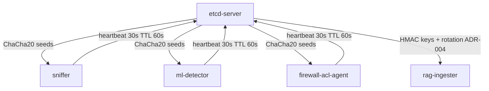

> **Open Source mode:** etcd distributes crypto seeds. Functional but not
> enterprise-grade. A compromised etcd exposes all component keys.
>
> **Enterprise ENT-3:** P2P key exchange. Each component pair negotiates session
> keys via Diffie-Hellman authenticated by component identity hashes (SHA256 of
> binary + config at startup). etcd is removed from the cryptographic trust chain.

---

## Cryptographic Transport

| Channel                    | Encryption        | Compression | Integrity      | Notes                        |
| -------------------------- | ----------------- | ----------- | -------------- | ---------------------------- |
| sniffer → ml-detector      | ChaCha20-Poly1305 | LZ4         | AEAD           | packet-to-ML transport       |
| ml-detector → firewall     | ChaCha20-Poly1305 | LZ4         | AEAD           | dual-score decision output   |
| CSV logs                   | —                 | —           | HMAC-SHA256    | forensic ingestion integrity |
| Component session keys     | Diffie-Hellman    | —           | SHA256         | ENT-3 P2P, no etcd reliance  |
| etcd → components          | ChaCha20-Poly1305 | —           | TLS            | open source mode             |

---

## Configuration System

**Principle:** JSON is the LAW. No hardcoded security values in production code.
Fallbacks are explicit and logged.

**Source files (always edit these, never build artifacts):**

| Component          | Config file                                               |
| ------------------ | --------------------------------------------------------- |
| sniffer            | `sniffer/config/sniffer.json`                             |
| ml-detector        | `ml-detector/config/ml_detector_config.json`              |
| firewall-acl-agent | `firewall-acl-agent/config/firewall_acl_agent_config.json`|
| rag-ingester       | `rag-ingester/config/rag_ingester_config.json`            |

> **Warning:** `sniffer/build-debug/config/sniffer.json` is a generated artifact.
> Changes are overwritten at build time. Always edit the source file.

---

## Validated Results

### F1 Comparison (DAY 81 — same PCAP, controlled)

| Condition              | DDoS | Ransom | Traffic | Internal | F1         | FP |
| ---------------------- | ---- | ------ | ------- | -------- | ---------- | -- |
| Production (JSON)      | 0.85 | 0.90   | 0.80    | 0.85     | **1.0000** | 0  |
| Legacy low thresholds  | 0.70 | 0.75   | 0.70    | 0.70     | **0.9976** | 1  |

### Specificity Validation (DAY 82-83 — benign traffic)

| Dataset         | Flows  | Network       | ML FP | FPR ML       | FD alerts | FPR FD |
| --------------- | ------ | ------------- | ----- | ------------ | --------- | ------ |
| smallFlows.pcap | 1,209  | 172.16.133.x  | 0     | 0%           | 3,741     | —      |
| bigFlows.pcap   | 40,467 | 172.16.133.x  | **2** | **0.0049%**  | 31,065    | 76.8%  |

**bigFlows confirmed benign:** network 172.16.133.x is not present in any CTU-13
binetflow. The Botnet-91 scenario (192.168.1.x) in ctu13/index.html is a completely
different dataset from Neris (147.32.x.x).

### Experiment Tracking

All F1 replay results in `docs/experiments/f1_replay_log.csv`:

| replay_id                  | day | F1         | Notes                          |
| -------------------------- | --- | ---------- | ------------------------------ |
| UNKNOWN_DAY79              | 79  | 0.9921     | Baseline after sentinel fix    |
| UNKNOWN_DAY80              | 80  | 0.9934     | JSON thresholds activated      |
| DAY81_thresholds_085090    | 81  | **1.0000** | First clean replay             |
| DAY81_condicionB           | 81  | 0.9976     | Legacy thresholds comparison   |
| DAY82-001                  | 82  | —          | smallFlows benign, attacks=0   |
| DAY82-002                  | 82  | —          | bigFlows, 2 FP conf>=0.65      |
| DAY83_verification         | 83  | **1.0000** | Pre-merge re-verification      |

---

## Performance Characteristics

### Latency Budget (End-to-End)

| Stage                        | Latency    | Note                          |
| ---------------------------- | ---------- | ----------------------------- |
| eBPF/XDP kernel capture      | <1 µs      |                               |
| Ring buffer to userspace     | <1 µs      | zero-copy                     |
| Feature extraction           | <10 µs     |                               |
| Fast Detector heuristics     | <5 µs      | Path A or B                   |
| ZeroMQ + ChaCha20 + LZ4      | <100 µs    |                               |
| ml-detector L1 (ONNX)        | ~26 ms     | optimization planned PHASE2   |
| ml-detector L2+L3 (embedded) | 0.24–1.06 µs |                             |
| firewall-acl-agent response  | <10 ms     |                               |
| **Total packet-to-block**    | **<150 ms**| ONNX dominates worst case     |

### Resource Usage (Single Node, Lab VM)

| Component                 | CPU         | Memory  |
| ------------------------- | ----------- | ------- |
| sniffer                   | 5–10%       | ~5 MB   |
| ml-detector               | 10–20%      | ~150 MB |
| firewall-acl-agent        | 5% (54% stress) | ~127 MB |
| rag-ingester              | variable    | ~50 MB  |
| rag-security (TinyLlama)  | 15–30%      | ~500 MB |
| etcd-server               | 2%          | ~20 MB  |
| **Total**                 | **<70%**    | **<900 MB** |

### Target Hardware by Deployment Tier

| Tier     | Hardware                        | Approx. Cost | Capacity         |
| -------- | ------------------------------- | ------------ | ---------------- |
| Minimal  | Raspberry Pi 5 (8 GB)           | 80 EUR       | SOHO, 1–5 devices |
| Standard | Mini-PC NUC (16 GB, dual NIC)   | 200 EUR      | School / clinic  |
| Full     | x86_64 server (32 GB, SFP+)     | 500 EUR      | Hospital / enterprise |

---

## Security Considerations

### Guarantees

- ChaCha20-Poly1305 AEAD — all inter-component traffic authenticated and encrypted
- HMAC-SHA256 CSV log integrity — tamper detection before RAG ingestion
- Autonomous blocking — no human in loop for confirmed threats
- JSON-driven thresholds — no hardcoded security parameters in production code
- Fail-closed design — component failure does not open firewall
- ThreadSanitizer validated — 0 races, 0 deadlocks in ShardedFlowManager

### Architectural Debt Register

| ID           | Description                              | Severity | Status     | Fix         |
| ------------ | ---------------------------------------- | -------- | ---------- | ----------- |
| DEBT-FD-001  | Fast Detector Path A hardcoded thresholds | High    | Open       | PHASE2 ADR-006 |
| DEBT-PHASE2  | 11/40 features use sentinel              | Medium   | Open       | PHASE2      |
| ADR-007      | Firewall MAX to AND consensus            | Medium   | Open       | PHASE2      |
| ENT-3        | etcd as crypto authority (open source)   | High     | Documented | Enterprise  |
| ONNX-L1      | ~26 ms ONNX overhead vs µs embedded      | Low      | Documented | PHASE2      |

---

## Development Environment

### Pipeline Commands

```bash
make pipeline-start              # Start all 6 components via tmux
make pipeline-stop               # Stop all components
make pipeline-status             # Check component status (PIDs)
make logs-lab-clean              # Clear all logs
bash scripts/pipeline_health.sh  # Detailed health monitor (runs inside VM: defender)
```

### Experiment Reproduction (Full F1 from Scratch)

```bash
make pipeline-stop && make logs-lab-clean && make pipeline-start && sleep 15
vagrant ssh defender -c "grep 'Thresholds (JSON)' /vagrant/logs/lab/sniffer.log"
vagrant up client   # only if client VM is not running
make test-replay-neris
python3 scripts/calculate_f1_neris.py \
  /vagrant/logs/lab/sniffer.log --total-events 19135
# Expected: F1-Score: 1.0000
```

### Log Locations

```
/vagrant/logs/lab/
  sniffer.log          Fast Detector alerts, thresholds confirmation
  detector.log         spdlog operational log (source of truth, ADR-005)
  ml-detector.log      startup output only
  firewall-agent.log   block decisions
  rag-ingester.log     CSV ingestion stats, HMAC validation
  rag-security.log     RAG query results
  etcd-server.log      key rotation, heartbeats

/vagrant/logs/ml-detector/events/YYYY-MM-DD.csv
  ML event log (score >= 0.50), HMAC per row
  Consumed by rag-ingester -> FAISS + SQLite -> forensic queries

/vagrant/logs/firewall_logs/firewall_blocks.csv
  Block decisions, HMAC per row
  Consumed by rag-ingester -> forensic history
```

---

## Production Deployment

### Planned: Debian 11 Hardened Installer (Post-Paper)

```bash
curl -fsSL https://ml-defender.io/install.sh | sudo bash
```

This will verify kernel requirements, compile for target architecture (x86_64 or
ARM64), verify SHA256 hashes against signed manifest, apply seccomp and AppArmor
profiles per component, and install systemd units with `CapabilityBoundingSet`.

### Planned: systemd Unit Startup Order

```
ml-defender-etcd.service           (starts first — provides crypto seeds)
ml-defender-sniffer.service         (After=etcd)
ml-defender-ml-detector.service     (After=sniffer)
ml-defender-firewall.service        (After=ml-detector)
ml-defender-rag-ingester.service    (After=ml-detector firewall)
ml-defender-rag-security.service    (After=rag-ingester)
```

Each unit: `Restart=always`, `CapabilityBoundingSet`, `seccomp` profile,
`PrivateTmp=yes`, `NoNewPrivileges=yes`.

---

## Roadmap

### Phase 1 — COMPLETE (DAY 83)

Pipeline 6/6 stable, F1=1.0000 on CTU-13 Neris, FPR=0.0049% on bigFlows benign,
CSV pipeline E2E validated (71,217 rows, 0 errors), merged to main.

### Phase 2 — Post-Paper (DAY 90+)

- Complete 40/40 real features (eliminate DEBT-PHASE2)
- Fix DEBT-FD-001 — inject FastDetectorConfig into Fast Detector Path A
- ADR-007 — AND consensus for firewall blocking
- ONNX L1 optimization or conversion to embedded C++20 RF
- Debian 11 bare-metal installer with seccomp profiles
- systemd production units
- CLI dashboard: `argus status`, `argus report`, `argus map`
- PDF/CSV report generation for management

### Enterprise

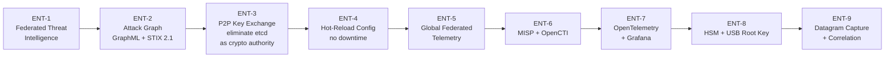

> **ENT-3 in detail:** Each component pair negotiates a session key via
> Diffie-Hellman authenticated by component identity hashes (SHA256 of binary +
> config at startup). etcd is removed from the cryptographic trust chain entirely.
> A compromised etcd no longer exposes component session keys.

---

## Addendum — Security & RAG Enhancements

### RAG Activation & Forensic Flow

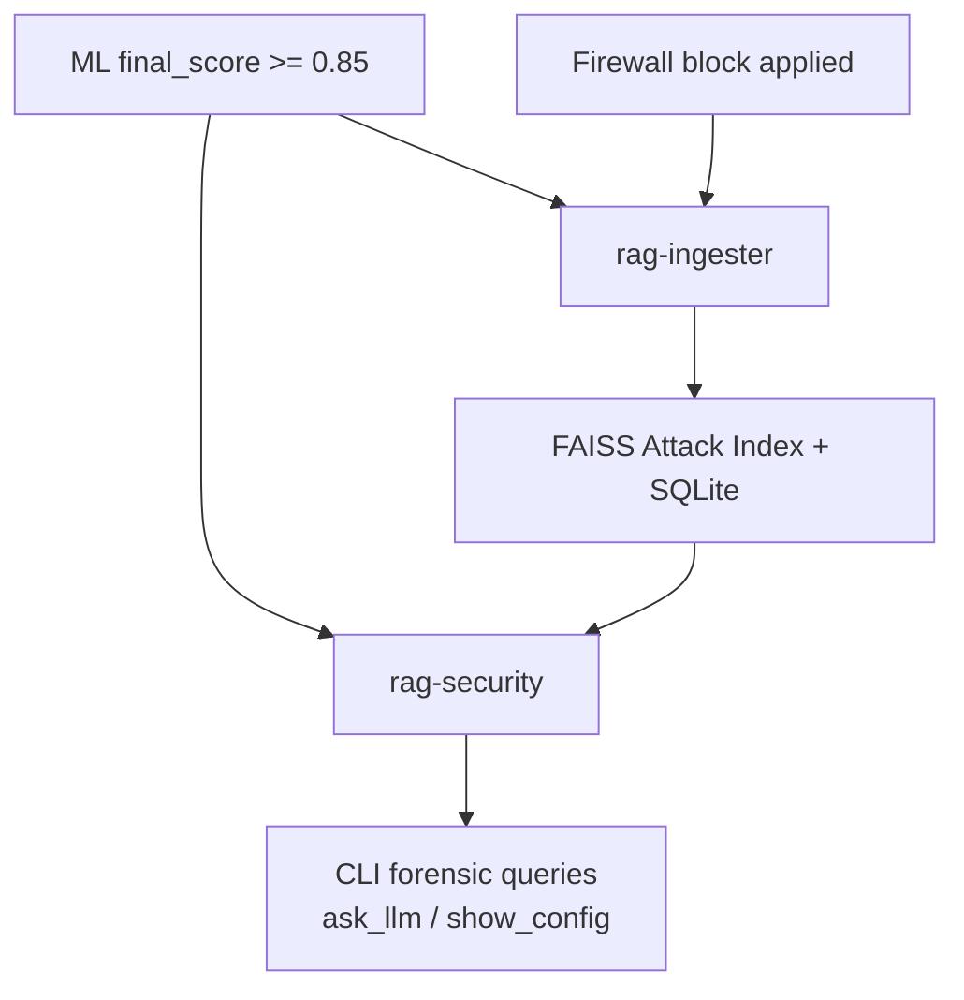

### Cryptographic Trust Levels

| Channel                | Encryption        | Compression | Integrity   | Notes                        |
| ---------------------- | ----------------- | ----------- | ----------- | ---------------------------- |
| sniffer → ml-detector  | ChaCha20-Poly1305 | LZ4         | AEAD        | packet-to-ML transport       |
| ml-detector → firewall | ChaCha20-Poly1305 | LZ4         | AEAD        | dual-score decision output   |
| CSV logs               | —                 | —           | HMAC-SHA256 | forensic ingestion integrity |
| Component session keys | Diffie-Hellman    | —           | SHA256      | ENT-3 P2P, no etcd reliance  |

---

## Executive Summary — 2 Minutes for CTO

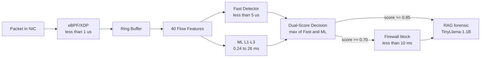

**Key Metrics**

| Metric                | Value                         |
| --------------------- | ----------------------------- |
| F1                    | 1.0000                        |
| ML FPR                | 0.0049%                       |
| Fast Detector FPR     | 76.8% — filtered by ML        |
| FP Reduction          | ~15,500x                      |
| Total latency         | <150 ms packet-to-block       |
| Embedded RF latency   | 0.24–1.06 µs                  |
| ONNX L1 latency       | ~26 ms (planned embed PHASE2) |
| Memory footprint      | <900 MB total                 |
| Min hardware          | Raspberry Pi 5 ~80 EUR        |

**Why This Matters**

A hospital or school running ML Defender on a 200 EUR mini-PC gets:
- Autonomous ransomware and DDoS detection and blocking
- Ultra-low false positive rate (0.0049%) — operators are not flooded with alerts
- Cryptographically authenticated event pipeline end-to-end
- Full forensic history queryable in natural language
- Zero dependency on router brand or firmware

**Architectural Highlights**

Dual-score validation, JSON-driven thresholds, ChaCha20 authenticated transport,
fail-closed design, sentinel-safe RF routing, ThreadSanitizer-validated concurrency.

**Roadmap**

PHASE2: complete 40/40 features, embed L1 RF, Fast Detector JSON config.
Enterprise: P2P key exchange, federated telemetry, attack graphs, SIEM integration.

---

## Engineering Decision Records

| ADR       | Title                              | Status      |
| --------- | ---------------------------------- | ----------- |
| ADR-001   | ChaCha20-Poly1305 for all transport | Implemented |
| ADR-002   | Multi-engine detection provenance  | Implemented |
| ADR-004   | HMAC key rotation with cooldown    | Implemented |
| ADR-005   | Unified ml-detector logging        | Post-paper with ENT-4 |
| ADR-006   | Fast Detector hardcoded thresholds | Fix PHASE2  |
| ADR-007   | Firewall AND consensus             | PHASE2      |
| ADR-DAY79 | Sentinel value taxonomy (-9999.0f) | Implemented |

Full ADR documents: `docs/adr/`

---

## Acknowledgments

**Author:** Alonso Isidoro Roman — Independent Researcher, Extremadura, Spain

**Consejo de Sabios (AI peer review throughout development):**
Claude (Anthropic), Grok, ChatGPT5, DeepSeek, Qwen

**Datasets:**
- CTU-13: Garcia, Sebastian et al. *An Empirical Comparison of Botnet Detection Methods.*
  Computers & Security, 2014. CVUT Prague — Stratosphere IPS Lab.
- bigFlows / smallFlows: CTU-13 supplementary captures (confirmed benign, 172.16.133.x)

---

**Via Appia Quality** — Built to last decades.

*Last updated: DAY 83 — March 12, 2026*
*Branch: main — tag: v0.83.0-day83-main*