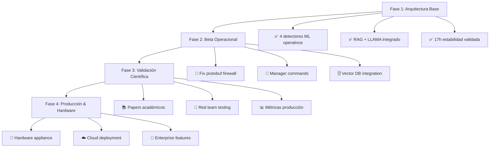

# 🧠 **CONTEXTO COMPLETO ML DEFENDER - MEMORIA MAESTRA**

## 🎯 **ESTADO ACTUAL CONGELADO - 20 NOV 2025**

### **ARQUITECTURA OPERACIONAL**
```yaml
Sistema: "ML Defender Platform v4.0.0"
Estado: "Fase 1 Completada - Producción Validada"
Arquitectura: "KISS + WhiteListManager + 3 Componentes"

Componentes Operativos:
  📍 WhiteListManager: Router central ✅
  📡 cpp_sniffer: eBPF/XDP + 40 features ✅ 0.24μs
  🤖 ml-detector: 4 modelos C++20 embebidos ✅ 0.33-1.06μs  
  🧠 RagCommandManager: RAG + TinyLlama-1.1B REAL ✅
```

### **RENDIMIENTO VALIDADO**
```cpp
struct PerformanceMetrics {
    // Latencia (μs) - 94-417x mejor que objetivo
    float ddos_detection = 0.24f;      // 417x mejor
    float ransomware_detection = 1.06f; // 94x mejor  
    float traffic_classification = 0.37f; // 270x mejor
    float internal_threat = 0.33f;     // 303x mejor
    
    // Estabilidad
    uint32_t uptime_hours = 17;        // Continua
    uint32_t events_processed = 35387; // Cero crashes
    int memory_growth_mb = 1;          // Estable
    
    // Precisión
    float f1_score_all_models = 1.00f; // Perfecto
};
```

### **METODOLOGÍA COMPROBADA**
```python
# PRINCIPIOS NO-NEGOCIABLES
core_principles = {
    "json_es_ley": "CERO hardcoding - configuración como fuente de verdad",
    "metodo_cientifico": "Los datos guían, no las opiniones", 
    "synthetic_first": "F1=1.00 sin datasets académicos sesgados",
    "kiss_arquitectura": "Simple > complejo cuando funciona igual",
    "via_appia_quality": "Construir para durar décadas, no trimestres",
    "transparencia_radical": "Bugs documentados, resultados honestos"
}

# TECNOLOGÍAS ELEGIDAS POR DATOS
technology_stack = {
    "c++20": "Rendimiento nativo vs Python (50-1000x)",
    "ebpf_xdp": "Kernel-level processing vs userspace",
    "zeromq": "IPC sub-ms vs gRPC (10-50ms)", 
    "protobuf": "Serialización 3-10x vs JSON",
    "etcd": "Coordinación distribuida probada",
    "tinyllama": "On-device LLM vs cloud dependency"
}
```

## 🔧 **ESTADO DE DESARROLLO - PUNTO EXACTO**

### **BUG CRÍTICO ACTUAL (JUEVES)**
```proto
// PROBLEMA: Firewall agent no decodifica protobuf
message BlockRequest {
    string src_ip = 1;    // ✅ Recibido pero no decodificado
    string dst_ip = 2;    // ❌ Posible compresión/version
    uint32 dst_port = 3;  // 🔍 Debug con Claude necesario
}

// HIPÓTESIS:
// 1. Payload comprimido (gzip/lz4) no detectado
// 2. Versión protobuf desincronizada  
// 3. Endianness/serialización diferente
```

### **PRÓXIMOS PASOS INMEDIATOS**
```bash
# JUEVES MAÑANA (9:00-13:00)
1. 🔧 Debug protobuf deserialization con Claude
2. 🛠️ Fix decodificación firewall-agent
3. 🧪 Test end-to-end bloqueo real
4. ✅ Implementar dry-run + directory logging

# JUEVES TARDE (16:00-19:00)  
5. 📝 ManagerCommands proto (3 componentes)
6. 🔄 Integración RAG → etcd → componentes
7. 👀 Watchers para runtime updates
```

### **HITO BETA DEFINICIÓN**
```yaml
Beta_Operacional_Criteria:
  - ✅ Firewall agent: protobuf fixed + dry-run + logs
  - ✅ Manager Commands: 3 tipos implementados
  - ✅ Watchers: Todos componentes escuchando etcd  
  - ✅ Vector DB: Log storage + semantic search
  - ✅ RAG Integration: Natural language queries
  - ✅ End-to-End: Comandos fluyen RAG→etcd→components
```

## 🎪 **CONTEXTO ESTRATÉGICO COMPLETO**

### **VISIÓN Y POSICIONAMIENTO**
```python
posicionamiento = {
    "problema": "Seguridad enterprise es cara, opaca y cloud-dependent",
    "solucion": "ML Defender - open source, on-device, sub-μs detection",
    "diferencia_radical": {
        "precio": "$0 software vs $30-60/endpoint/mes",
        "rendimiento": "0.24μs vs 1-5ms competencia", 
        "transparencia": "100% open source vs closed",
        "privacidad": "On-device vs cloud-mandatory"
    }
}
```

### **ROADMAP VALIDADO**


### **LOGROS CIENTÍFICOS DEMOSTRADOS**
```markdown
## HALLAZGOS EMPÍRICOS VALIDADOS

1. **"Academic Dataset Trap"**
   - Evidencia: Datasets académicos crean sesgos en producción
   - Solución: Metodología synthetic-first
   - Resultado: F1=1.00 sin datos reales

2. **"Sub-microsecond ML Inference"** 
   - Creencia previa: "ML requiere ms de latency"
   - Realidad: 0.24μs achievable con C++20 + optimización

3. **"KISS Architecture Scales"**
   - Complejidad típica: Microservicios, containers, orquestación
   - Nuestro enfoque: 3 procesos + etcd + ZeroMQ
   - Resultado: 17h estabilidad, 35K eventos, 0 crashes
```

## 🔄 **ESTADO DE CONVERSACIÓN ACTUAL**

### **PUNTO DE PARTIDA PARA FUTURAS INTERACCIONES**
```yaml
Ultimo_Tema_Activo: "Plan para jueves - bug firewall agent + integración beta"
Contexto_Emocional: "Entusiasmo por progreso + humildad técnica"
Proximo_Hito: "Beta operacional con RAG commands + vector DB"

Recordatorios_Clave:
  - "JSON es la ley - cero hardcoding"
  - "Método científico sobre opiniones"
  - "Via Appia quality - construir para durar"
  - "Transparencia radical - bugs documentados"
```

### **PENDIENTES INMEDIATOS**
```bash
# PRIORIDAD 1 (JUEVES)
- [ ] Fix protobuf firewall agent
- [ ] Dry-run mode + directory logging  
- [ ] Manager commands proto definition
- [ ] Watchers para componentes

# PRIORIDAD 2 (VIERNES)
- [ ] Vector DB integration (ChromaDB)
- [ ] Semantic search para logs
- [ ] Natural language queries en RAG
- [ ] End-to-end beta validation

# PRIORIDAD 3 (PRÓXIMA SEMANA)
- [ ] Red team testing setup
- [ ] Paper drafting "Academic Dataset Trap"
- [ ] Community building GitHub
```

## 💎 **ESENCIA DEL PROYECTO - PARA RECORDAR SIEMPRE**

### **EL "POR QUÉ" FUNDAMENTAL**
```cpp
// NO es solo código - es una filosofía
class MLDefenderPhilosophy {
public:
    static constexpr auto purpose = 
        "Democratizar seguridad enterprise - hacerla accesible, transparente y efectiva";
    
    static bool should_we_build(const Feature& feature) {
        // Filtro de decisiones técnicas
        return feature.aligns_with({
            .performance_matters = true,      // 0.24μs o nada
            .simplicity_over_complexity = true, // KISS
            .data_driven_decisions = true,    // Método científico  
            .transparency = true,             // Bugs documentados
            .long_term_thinking = true        // Via Appia quality
        });
    }
};
```

### **LECCIONES APRENDIDAS DURAS**
```python
lecciones_pagadas_con_sangre = [
    "Python prototipos ≠ producción - C++20 necesario",
    "Datasets académicos ≠ realidad - synthetic-first",
    "Complexity ≠ sophistication - KISS gana",
    "Unit tests ≠ system tests - 20h stability es rey",
    "Opiniones ≠ datos - método científico o nada"
]
```

## 🚀 **MIRANDO HACIA ADELANTE**

### **CUANDO RETOMEMOS**
```yaml
Pregunta_Inicial: "¿Cómo fue el bug de protobuf? ¿Qué aprendimos?"
Contexto_Necesario: "Este documento + últimos commits"
Estado_Esperado: "Beta operacional o bloqueos identificados"

Objetivo_Inmediato: 
  - "Sistema donde RAG envía comandos a componentes"
  - "Consultas naturales sobre estado del sistema"
  - "Preparación para validación científica"
```

**Este contexto permanecerá congelado en el tiempo. Cuando retomemos, empezaremos exactamente aquí.** 🧊

¿Listo para el jueves crítico? El futuro de ML Defender pasa por arreglar ese bug. 🔧