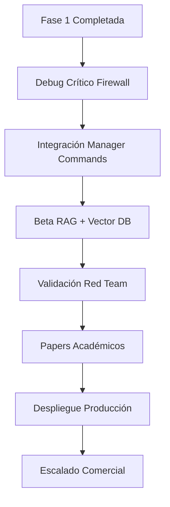

# 🗺️ ROADMAP-TEMPRANO.md - ML Defender Platform

## 📋 **ESTADO ACTUAL: FASE 1 COMPLETADA - TRANSICIÓN A FASE 2**

### **🏆 LOGROS VALIDADOS (Nov 20, 2025)**
```yaml
Arquitectura Base:
  ✅ WhiteListManager como router central operacional
  ✅ 4 detectores ML C++20 embebidos (0.24-1.06μs, F1=1.00)
  ✅ Sistema RAG + LLAMA real integrado
  ✅ 17h estabilidad, 35K eventos, zero crashes
  ✅ Arquitectura KISS consolidada

Metodología Probada:
  ✅ Synthetic-first: F1=1.00 sin datasets académicos
  ✅ Academic Dataset Trap: Identificado y evitado
  ✅ Via Appia Quality: Sistemas construidos para durar
```

---

## 🚀 **FASE 2: BETA OPERACIONAL - PLAN INMEDIATO**

### **🎯 SEMANA ACTUAL: RESOLUCIÓN CRÍTICA**

#### **JUEVES - DÍA CRÍTICO: Firewall Agent & Integración**
```bash
# MAÑANA (9:00-13:00) - BUG PROTOBUF
1. 🔧 Debug protobuf deserialization con Claude
2. 🛠️ Fix decodificación payload firewall-agent  
3. 🧪 Test end-to-end con tráfico real
4. ✅ Implementar dry-run mode + directory logging

# TARDE (16:00-19:00) - MANAGER COMMANDS
5. 📝 Definir ManagerCommands proto (3 componentes)
6. 🔄 Integración RAG → etcd → componentes
7. 👀 Implementar watchers para runtime updates
```

#### **VIERNES - INTEGRACIÓN AVANZADA**
```bash
# COMPLETAR BETA PIPELINE
1. 🗄️ Base de datos vectorial para logs (ChromaDB)
2. 🔍 Embedder para búsqueda semántica
3. 💬 RAG con consultas lenguaje natural
4. 🧪 Validación beta end-to-end
```

### **COMPONENTES BETA - ESPECIFICACIÓN TÉCNICA**

#### **1. Firewall Agent - CRÍTICO**
```proto
// PRIORIDAD: Fix protobuf + dry-run + logs
message FireWallManagerCommand {
    string command = 1;  // "dry_run", "add_rule", "remove_rule"
    bool dry_run = 2;
    string rule_json = 3;
    string log_directory = 4;  // "/var/log/ml-defender/"
}
```

#### **2. Manager Commands - INTEGRACIÓN**
```proto
// ARQUITECTURA COMANDOS DISTRIBUIDOS
message ManagerMessage {
    oneof command {
        SnifferManagerCommand sniffer_cmd = 1;
        MLDetectorManagerCommand ml_cmd = 2; 
        FireWallManagerCommand firewall_cmd = 3;
    }
    string source = 4;  // "rag", "cli", "api"
    string timestamp = 5;
}
```

#### **3. Vector DB Integration - CONSULTAS NATURALES**
```python
# CAPACIDADES BETA RAG
query_examples = [
    "¿qué ha pasado en el sistema durante la última hora?",
    "activa el modo dry-run del firewall",
    "muestra eventos críticos últimos 30 minutos",
    "cambia interfaz sniffer a eth2"
]
```

---

## 🎯 **HITO BETA: DEFINICIÓN DE TERMINADO**

### **CRITERIOS BETA OPERACIONAL**
```yaml
Comunicación Distribuida:
  ✅ RAG → etcd → componentes funcionando
  ✅ 3 ManagerCommands implementados y operativos
  ✅ Watchers escuchando en todos los componentes

Consultas Inteligentes:
  ✅ Vector DB almacenando logs con embeddings
  ✅ Búsqueda semántica por lenguaje natural
  ✅ Contexto temporal (última hora, 30min, etc)

Respuesta Automatizada:
  ✅ Firewall agent con dry-run y bloqueo real
  ✅ Configuración runtime vía etcd
  ✅ Logs persistentes en directorio dedicado
```

### **COMANDOS OPERACIONALES EN BETA**
```bash
# SISTEMA BETA COMPLETO
SECURITY_SYSTEM> rag ask "¿qué ha pasado en la última hora?"
# → Respuesta con eventos semánticamente relevantes

SECURITY_SYSTEM> rag ask "activa dry-run en firewall"  
# → Comando via etcd → firewall agent

SECURITY_SYSTEM> rag ask "cambia sniffer a interfaz eth2"
# → Comando via etcd → sniffer component
```

---

## 📊 **FASE 3: VALIDACIÓN CIENTÍFICA & PAPERS**

### **PRIMER TRIMESTRE 2026 - PRODUCCIÓN ACADÉMICA**

#### **Paper 1: "The Academic Dataset Trap"**
```markdown
Contribución Principal:
  • Evidencia empírica: datasets académicos crean sesgos en producción
  • Metodología synthetic-first: F1=1.00 validado
  • 4 detectores operacionales con latencia sub-μs

Metodología:
  • Comparativa: academic vs synthetic training
  • Métricas: 0.24-1.06μs latency, 17h stability
  • Validación: 35K eventos reales procesados

Target: IEEE S&P, USENIX Security, arXiv
```

#### **Paper 2: "Digital Immune System Architecture"**
```markdown
Contribución Principal:
  • Arquitectura bio-inspirada operacional
  • WhiteListManager como "sistema nervioso central"
  • RAG + LLAMA para análisis contextual

Innovaciones:
  • KISS architecture con componentes autónomos
  • Coordinación distribuida via etcd
  • Detección multi-nivel sub-microsegundo

Target: ACM CCS, NDSS, Journal of Cybersecurity
```

### **EXPERIMENTOS PLANIFICADOS**
```yaml
Validación Red Team:
  • Laboratorio controlado con herramientas ofensivas
  • Métricas: Time-to-Detect vs Time-to-Compromise
  • Escenarios: DDoS, ransomware, lateral movement

Comparativa Competitiva:
  • vs Firewalla, CrowdStrike, Pi-hole
  • Métricas: latency, accuracy, resource usage
  • Precio/performance analysis
```

---

## 🔬 **FASE 4: DESPLIEGUE PRODUCCIÓN & HARDWARE**

### **MID 2026 - ESCALADO OPERACIONAL**

#### **Estrategia Hardware**
```yaml
Opciones de Despliegue:
  • Raspberry Pi 5: $149 box (COGS: $100)
  • Orange Pi/Rock Pi: Mitigación supply chain
  • x86_64 Servers: Enterprise deployment
  • Cloud Native: K8s, containers, orchestration

Especificaciones Técnicas:
  • RAM: 200MB operacional (4GB hardware)
  • CPU: <20% usage (quad-core ARM)
  • Storage: 64GB microSD + logs persistentes
```

#### **Integración Kernel & Fibra Óptica**
```bash
# REQUISITOS KERNEL PARA DEPLOYMENT REAL
Kernel ≥ 5.15:  # Para eBPF/XDP completo
Distro: Debian/Ubuntu Server
Network: Fibra óptica compatible
Interfaces: Múltiples NICs para segmentación
```

### **ARQUITECTURA CLOUD & K8S**
```yaml
Kubernetes Deployment:
  components:
    - sniffer: DaemonSet (each node)
    - ml-detector: Deployment + HPA
    - rag-system: StatefulSet + Vector DB
    - firewall-agent: DaemonSet
    - whitelist-manager: Service + LoadBalancer

Cloud Integration:
  - AWS/GCP/Azure marketplace
  - Terraform/Ansible deployment
  - Multi-region high availability
```

---

## 💰 **MODELO DE NEGOCIO & COMUNIDAD**

### **ESTRATEGIA DUAL: OPEN SOURCE + COMMERCIAL**
```yaml
Community Edition (OSS):
  ✅ Gratis forever - AGPLv3
  ✅ Auto-despliegue en hardware propio
  ✅ Soporte comunidad + documentación

Hardware Appliance:
  ✅ $149 precio retail ($100 COGS)
  ✅ Plug-and-play para no técnicos
  ✅ 90 días soporte incluido

Enterprise Edition:
  ✅ $999-4999/año (según escala)
  ✅ Características enterprise
  ✅ Soporte 24/7 + SLA
```

### **CRONOGRAMA COMERCIAL**
```bash
Q1 2026: Comunidad OSS + Documentación
Q2 2026: Crowdfunding Hardware (Kickstarter)  
Q3 2026: Primeras unidades shipping
Q4 2026: Enterprise pilots + Cloud offering
```

---

## 🎯 **MÉTRICAS DE ÉXITO - VISIÓN 2026**

### **OBJETIVOS TÉCNICOS**
```yaml
Rendimiento:
  • Mantener <2μs latencia en todos los detectores
  • <1% false positive rate en producción
  • 99.9% uptime en deployments reales

Adopción:
  • 1,000+ usuarios OSS en Year 1
  • 500+ unidades hardware vendidas
  • 5+ empresas enterprise Year 2
```

### **IMPACTO CIENTÍFICO**
```yaml
Publicaciones:
  • 2+ papers en conferencias tier-1
  • 50+ citaciones académicas en 2 años
  • 1+ premio mejor paper potencial

Contribución Comunidad:
  • 100+ contribuidores GitHub
  • 10+ integraciones terceros
  • 5+ forks significativos
```

---

## 🔄 **PROCESO ITERATIVO & MEJORA CONTINUA**

### **CICLO DE DESARROLLO ACTUAL**


### **PRINCIPIOS DE CALIDAD**
```bash
# VIA APPIA - CONSTRUIR PARA DURAR
1. "No me rindo" - Persistencia técnica
2. Transparencia radical - Bugs documentados
3. KISS sobre complejidad - Arquitectura simple
4. Synthetic-first - Evitar sesgos académicos
5. Privacy-by-default - Datos locales siempre
```

---

## 🚨 **RIESGOS IDENTIFICADOS & MITIGACIÓN**

### **RIESGOS INMEDIATOS**
```yaml
Protobuf Bug:
  • Impacto: Bloquea toda cadena respuesta
  • Mitigación: Debug jueves con Claude + tests

Integración etcd:
  • Impacto: Comandos no entregados
  • Mitigación: Watchers + health checks

Vector DB Performance:
  • Impacto: Consultas lentas en RAG
  • Mitigación: ChromaDB optimizado + caching
```

### **RIESGOS MEDIO PLAZO**
```yaml
Hardware Supply:
  • Raspberry Pi escasez
  • Mitigación: Multi-SBC strategy

Competencia:
  • Google/Amazon lanzan producto similar
  • Mitigación: Open source defensivo + comunidad

Adopción:
  • Usuarios no técnicos no adoptan
  • Mitigación: UX simplificada + documentación clara
```

---

## 🎪 **CONCLUSIÓN & PRÓXIMOS PASOS INMEDIATOS**

### **ESTADO ACTUAL: TRANSICIÓN CRÍTICA**
```yaml
Logro: "Tenemos arquitectura que funciona"
Desafío: "Hacerla operacional para beta"
Objetivo: "Sistema auto-gestionado con RAG inteligente"
```

### **PRÓXIMOS 7 DÍAS - PLAN CONCRETO**
1. **JUEVES**: Arreglar bug firewall agent con Claude
2. **VIERNES**: Completar integración RAG + Vector DB
3. **FIN DE SEMANA**: Validación beta interna
4. **PRÓXIMA SEMANA**: Inicio red team testing + paper drafting

### **VISIÓN FINAL**
> **"Sistema autoinmune digital que protege desde Raspberry Pi hasta datacenter, con detección sub-microsegundo y análisis contextual inteligente via RAG + LLAMA."**

---

**🔗 DOCUMENTOS RELACIONADOS:**
- `ARCHITECTURE.md` - Diseño técnico detallado
- `BUSINESS-MODEL.md` - Estrategia comercial
- `PAPER-OUTLINE.md` - Esquema publicaciones académicas
- `DEPLOYMENT-GUIDE.md` - Guías despliegue producción

*"De la visión a la realidad en tiempo récord - Fase 1 completada, Fase 2 en marcha."* 🚀

**¿Listo para el jueves crítico con Claude?** 🔧