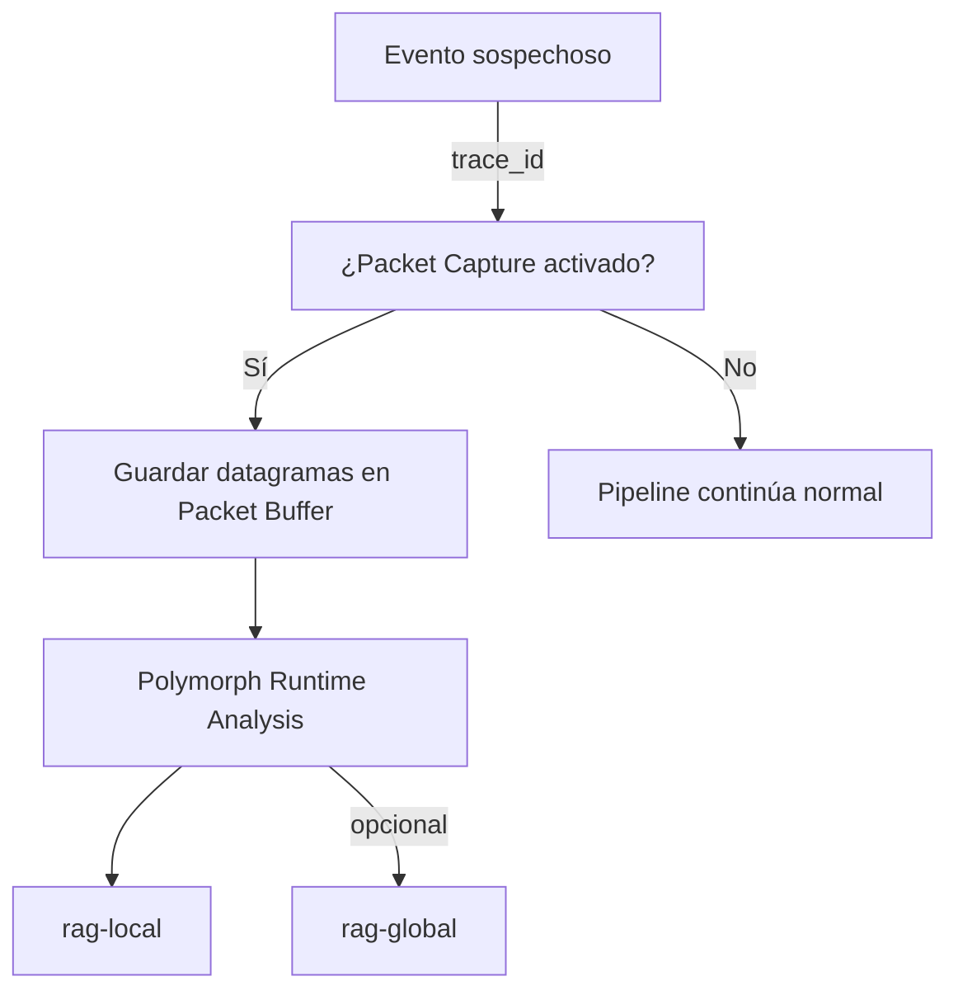

Perfecto, Alonso. Te propongo una versión extendida del ADR con **diagramas conceptuales en Markdown (ASCII / Mermaid)** y flujos de datos para que quede listo para presentar al consejo. Incluye todos los detalles técnicos que mencionaste.

---

# ADR-008: Captura y correlación opcional de datagramas sospechosos

**Fecha:** 2026-03-11 (PROPUESTA — PHASE2)
**Autores:** Alonso Isidoro Roman + Claude (Anthropic)
**Relacionado con:** ADR-002, ADR-006, ADR-007

---

## Contexto

Actualmente, el pipeline de ML Defender almacena datos de eventos como CSV y `.proto`. Esto permite reentrenamiento y auditoría, pero **no permite inspección de datagramas en bruto**.
El objetivo de este ADR es proponer un mecanismo **opcional, controlable y temporal**, para almacenar datagramas de eventos sospechosos, correlacionados mediante `trace_id`, con el fin de:

1. Permitir análisis forense de cabeceras y metadatos incluso si TLS no se rompe.
2. Confirmar o enriquecer información ya capturada en CSV.
3. Preparar la infraestructura para posibles escenarios donde TLS sea descifrado en el futuro.

El mecanismo se integraría con la herramienta Python de Santiago Hernández para manipulación y análisis en runtime de paquetes (`runtime-pcap-framework`), disponible para `rag-local` y, opcionalmente, `rag-global`.

---

## Requisitos

* **Activación controlada** desde `rag.json`:

```json
"packet_capture": {
    "enabled": true,
    "duration_seconds": 300,
    "window_size_seconds": 30,
    "max_packets_per_trace": 1000,
    "persist": false
}
```

* **Correlación por `trace_id`**: los datagramas deben asociarse con eventos detectados por `ml-detector` y `firewall-acl-agent`.
* **Persistencia temporal opcional**: borrar automáticamente o mantener para reentrenamiento.
* **Integración asíncrona**: no bloquear el flujo principal del pipeline.
* **Filtrado por 5-tuple**: permitir seleccionar únicamente paquetes relevantes para eventos sospechosos.
* **Compatibilidad con RAG-security**: `rag-local` y `rag-global`.

---

## Arquitectura Conceptual

### Diagrama de flujo de datos

```mermaid
flowchart LR
    A[Sniffer] -->|captura paquetes| B[Packet Buffer (opcional)]
    B -->|asociación trace_id| C[ml-detector]
    C --> D[firewall-acl-agent]
    C --> E[CSV / Proto storage]
    B --> F[Polymorph / Runtime Analyzer (Santiago Framework)]
    F --> G[rag-local]
    F -->|opcional| H[rag-global]
```

**Notas:**

* `Packet Buffer` es temporal y solo se activa bajo configuración.
* `trace_id` permite correlacionar paquetes con eventos de ML y Fast Detector.
* `Polymorph` sirve para inspección, modificación y extracción de metadatos.

---

### Diagrama conceptual de decisión



* Permite **no saturar almacenamiento**, activar solo para ataques detectados.
* Garantiza que flujo principal del pipeline no se vea afectado.

---

## Flujo de implementación

1. `sniffer` captura datagramas de manera habitual.
2. Cuando un evento es detectado por `ml-detector` o `Fast Detector`, se consulta `rag.json` para ver si la captura opcional está activada.
3. Si está activada:

    * Se copia la versión completa del datagrama en un **buffer temporal**.
    * Se guarda `trace_id` y 5-tuple para correlación futura.
4. `Polymorph / Runtime Analyzer` procesa estos datagramas:

    * Inspección de cabeceras.
    * Generación de metadatos adicionales.
5. Datos enriquecidos pasan a `rag-local` y opcionalmente a `rag-global` para análisis centralizado.
6. Opcional: persistencia temporal de los datagramas para reentrenamiento.

---

## Ventajas

* Permite **confirmar hipótesis** de ataque con cabeceras completas.
* Compatible con **reentrenamiento futuro** y análisis forense.
* Controlable, activable solo cuando hay eventos sospechosos, minimizando riesgo de almacenamiento excesivo.
* Integración con herramientas existentes (`Polymorph / runtime-pcap-framework`) y `rag-local`/`global`.

---

## Limitaciones / Trade-offs

* No rompe TLS; contenido cifrado sigue inaccesible.
* Persistencia opcional para no saturar almacenamiento.
* Requiere **sincronización precisa de `trace_id`** y correlación con CSV/Proto para evitar inconsistencias.
* Procesamiento asíncrono puede añadir **latencia mínima** si el volumen de eventos es muy alto.

---

## Próximos pasos PHASE2

1. Implementar buffer temporal en `sniffer` con capacidad de activación/desactivación por `rag.json`.
2. Integrar con `Polymorph Runtime Analyzer` para inspección asíncrona.
3. Validar correlación por `trace_id` con `ml-detector` y `firewall`.
4. Probar persistencia temporal, windowing y eliminación automática.
5. Documentar el flujo en ADR-008 para futura auditoría y paper.

---

Si quieres, puedo hacer **una versión extendida del diagrama de flujo incluyendo la relación con CSV, Proto y Reentrenamiento**, mostrando cómo esta captura opcional puede alimentar directamente modelos futuros sin interferir con el pipeline normal.

¿Quieres que haga esa versión también?
